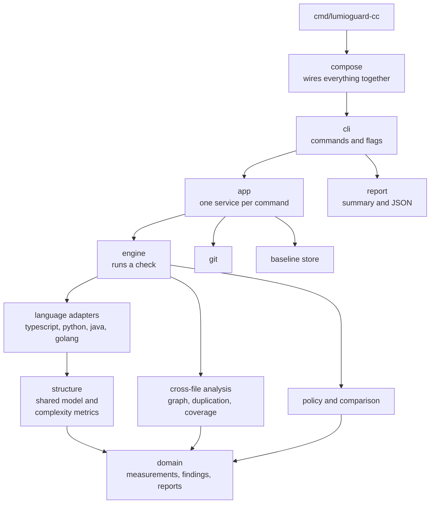

# Development guide

How to change lumioguard CC safely. Read [Contribute](index.md) first for issues and pull requests.

## Design principles

People and agents act on the tool's output without reading its code. Each principle keeps that output
accurate. Breaking one needs a discussion first.

1. **Incomplete is not clean.** A parse failure, an unsupported included file or a missing required
   coverage report gives status `incomplete` and exit code 2, which beats exit code 1. Otherwise the most
   broken code would look the best.
2. **Same input, same output.** Results are sorted with fixed keys; only `run` changes. Agents and
   reviewers compare runs, so noise makes every difference suspect.
3. **No silent zeros.** A value that cannot be measured is `null` with a status and a reason. A made-up
   number looks like evidence.
4. **Compare only like with like.** A stored baseline is used only when schema, adapter identities and
   configuration hash match, and only new or worsened blocking findings fail.
5. **`check` never writes.** Only `init` and `baseline create` write files. `check` runs constantly,
   often automatically, so it must always be safe.
6. **One JSON document on stdout.** Everything else goes to stderr. Tools parse stdout directly, so one
   stray line breaks them.
7. **Metrics are computed once.** Complexity lives only in `internal/adapter/structure`, and a metric ID
   never changes meaning.
8. **Adapters never guess.** An import that should resolve but does not is a warning, and outside code
   is counted as external. A graph with hidden gaps gives confident, wrong answers.
9. **Official, checkable supply chain.** Every dependency is its canonical upstream, the standard library
   is preferred, and copied code is recorded in `internal/thirdparty/components.go`.
10. **Time alternatives in separate processes.** The ANTLR parser caches state, so whichever approach runs
    second in one process looks faster.

## Key decisions

- **One shared model for every language.** Adapters translate syntax into a small model of functions
  and control flow, and the metrics run once over it. Per-language walkers would drift apart.
- **One Go binary with the parsers compiled in.** No runtime to install, so results are the same on a
  laptop, in CI and in an agent sandbox. TypeScript uses Microsoft's typescript-go parser, copied because
  its packages are internal. Python uses a parser written for this project. Java uses an ANTLR-generated
  parser; `tools/java-grammar-sync` asserts that generated code never calls the runtime's version check.
  Go uses the standard library's `go/parser`, whose behaviour is fixed by the Go release a binary is
  built with; release builds pin that release.
- **A Go import points at one file.** Fan-out counts files, and a Go import names a package. The edge
  goes to the package's first non-test file in name order, so fan-out equals the number of packages
  imported instead of growing with the size of each package.
- **Source tokens as the size of a codebase.** `size.file_tokens` and `size.total_tokens` reuse the
  adapters' clone tokens. They are not a language model's tokens, but they move with them, and they are
  free to compute and deterministic. The summary prints the total and its delta, because the amount of
  code an agent must read is the cost every later task pays.
- **SARIF is derived, JSON is the record.** `--format sarif` is built from the same report and holds
  less: active findings, their locations and analysis notifications. Nothing exists only in SARIF, so
  tools and agents that need measurements or resolved findings read the JSON report.
- **No overall debt score.** Complexity, duplication and coupling have different units, and any weighting
  would be arbitrary.
- **Advisory defaults.** There is no universal complexity limit, so size and complexity only warn by
  default. Cycles and declared boundaries block, because they describe intended structure.
- **Import coverage, never run tests.** Running a project's tests is slow, machine-specific and can have
  side effects.
- **Bounded, opt-in agent integration.** The Claude Code hook blocks at most twice per session, compares
  with `HEAD` by default, lists only findings that fail, and names the exact command to reproduce them, so
  the loop can end on code with existing debt.
- **Guides ship in the binary.** `lumioguard-cc guide` topics live in `internal/guide/topics/`, so
  agents read instructions that match the installed version. Tests fail if a guide names a command or
  flag that does not exist.

## Code layout

Dependencies point inwards, towards `domain`.



| Package | Responsibility |
| --- | --- |
| `cmd/lumioguard-cc`, `internal/compose` | Entry point and composition root; only `compose` creates concrete types |
| `internal/cli` | Cobra commands: parse flags, call one service, render, map the exit code |
| `internal/report` | The summary, the JSON report and the SARIF log derived from it |
| `internal/app` | One service per command, with collaborators behind interfaces in `ports.go` |
| `internal/engine` | One analysis: discovery, parallel adapters, analyzers, thresholds, ordering, comparison |
| `internal/adapter` | `LanguageAdapter`, `ImportResolver`, `Registry`, `ModuleIndex`, measurement builder |
| `internal/adapter/structure` | Shared control-flow model and the only complexity implementation |
| `internal/adapter/{typescript,python,java,golang}` | Parse, translate to `structure`, tokens, imports, resolver |
| `internal/analysis/{graph,duplication,tokens,coverage}` | Cross-file checks |
| `internal/domain` | Measurements, findings, reports, config, baselines, exit codes; no I/O |
| `internal/guide` | The task guides printed by `lumioguard-cc guide` |
| `internal/{comparison,policy,baseline,git,config,discovery,report,explain,language}` | Single-purpose services |
| `internal/thirdparty/tsgo`, `internal/adapter/java/syntax` | Copied and generated parsers; never edit by hand |
| `tools/*` | Sync, audit, notices, corpus and benchmark commands; not in the binary |

`domain` imports nothing from this module, adapters never import each other or `engine`, and
`structure` depends only on `domain`.

## Adding a language

Open an issue first: a language is a long-term commitment that ends up in people's baselines.

1. **Choose a parser** that keeps the binary pure Go: a maintained Go parser, a parser generated from a
   maintained grammar, copied upstream code refreshed by a tool, or, as a last resort, a hand-written
   parser validated on a large corpus. Record copied code in `internal/thirdparty/components.go`.
2. **Register the extensions** in `internal/language`. That table feeds `Supports`, the default include
   patterns and report counts. Note in `CHANGELOG.md` that the default configuration hash changes.
3. **Implement `adapter.LanguageAdapter`** in `internal/adapter/<language>`. A syntax error is a required
   diagnostic such as `<language>.parse_failed`, never a partial result.
4. **Translate functions** into `structure.Function`, call `structure.AssignSymbols`, the `structure`
   metrics and `sourcetext.CountSourceLines`, then `adapter.FunctionMeasurements`. Never compute
   complexity in the adapter.
5. **Produce tokens** without comments, and **collect imports** with an `ImportResolver`.
6. **Wire it** into `compose.NewRegistry` and `tools/parse-corpus`.
7. **Test it** like the other adapters: the shared reference fixture (`score`: cyclomatic 5, nesting 3,
   parameters 3, cognitive 7), every mapped construct, tokens, imports, resolver cases, a parse failure,
   and a mixed-language repository. Then run `go run ./tools/parse-corpus -lang <language> -dir <sources>`.
8. **Document it** in the [rules pages](../rules/index.md), [Languages and limits](../reference/languages.md)
   and `CHANGELOG.md`. Never advertise a language before every step is done.

## Adding or changing a rule

Rule IDs are a public interface: people store them in baselines and agents parse them. Open an issue
first.

1. **Add the ID** to `internal/domain/metric.go` as `<category>.<name>`.
2. **Compute it in the right place:** control flow in `internal/adapter/structure`, function size in the
   adapters, cross-file checks as a `RepositoryAnalyzer` in `internal/analysis`. Give every measurement an
   exact `Variant`, a status and evidence.
3. **For a threshold,** add the policy to `MetricsConfig` and `Config.PolicyFor` in
   `internal/domain/config.go`, an advisory default in `internal/config/defaults.go`, and the key to
   `metricNames` in `internal/config/validate.go`. A new key invalidates existing configuration files, so
   bump the schema version.
4. **Update** `schemas/` and `schemas/schemas_test.go`, `internal/explain/catalog.go`, the guides in
   `internal/guide/topics/`, and the matching [rules page](../rules/index.md) with a worked example whose
   numbers come from running the binary.
5. **Test** with hand-checked values, and extend every adapter's reference fixtures.

**Changing how an existing rule counts:**

- Change the measurement `Variant` and bump `Version` in every affected adapter.
- Update fixtures and explain each changed expectation in the pull request.
- Rerun the worked examples with `sh .examples/run.sh bin/lumioguard-cc` and update their `REPORT.md`
  files.
- Say in `CHANGELOG.md` that users must create replacement stored baselines.

## Testing

```bash
go test ./...
gofmt -l .                             # must print nothing
go vet -unreachable=false ./...        # the generated Java parser trips only this check
golangci-lint run ./...                # must report 0 issues
go build -o bin/lumioguard-cc ./cmd/lumioguard-cc
sh .examples/run.sh bin/lumioguard-cc  # worked examples
```

| Test | What it proves |
| --- | --- |
| `TestRepeatedAnalysisIsDeterministicApartFromRunMetadata` | A 1-worker and an 8-worker run produce identical JSON |
| `TestParseFailureIsIncomplete`, `TestUnsupportedLanguageIsNeverGuessed` | Code that was not analyzed never looks clean |
| `TestGitBaseComparisonDoesNotModifyCheckout` | `--base` uses real Git and leaves the checkout alone |
| `TestClaudeStopHook...` | The hook's default reference, its conflict check and its two-attempt limit |
| `TestGuidesMentionOnlyRealCommandsAndFlags` | The built-in guides match the command tree |
| `TestProducedReportAndBaselineMatchSchemas` | Real output matches the published schemas |
| `TestSarifOutputListsActiveFindingsWithLocations` | SARIF carries every active finding with its file, line and a stable fingerprint |
| `TestResolveGoImports`, `TestAnalyzeFileFindsTheNearestModule` | Go imports follow `go.mod` files, and test files never stand for a package |

- **Conventions:** standard `testing` only, `t.TempDir()`, `t.Helper()`, and real `git` with `t.Skip`
  when it is missing.
- **Worked examples:** the runner checks that each bad version fails and its refactor resolves every
  finding. Never fix `.examples/*/before/`.
- **Parser changes:** run `go run ./tools/parse-corpus` on a real corpus.

### Documentation

The site is built with [Zensical](https://zensical.org) from `.documentations/`.

```bash
pip install -r requirements-docs.txt
make docs          # build dist/site in strict mode, failing on broken links
make docs-serve    # preview at http://localhost:8000
```

Zensical skips folders whose names start with a dot, so both targets copy `.documentations/` to
`dist/docs-src` first. Add every new page to `nav` in `zensical.toml`.

## Releasing

The project uses [Semantic Versioning](https://semver.org/). Before 1.0, minor releases may change
measurements or formats.

1. The Build workflow is green on Linux, macOS and Windows.
2. `make audit` reports nothing, and `make notices` leaves `THIRD-PARTY-NOTICES.md` current.
3. The worked examples still match their reports.
4. `CHANGELOG.md` moves "Unreleased" under the new version, calling out baseline or configuration breaks.
5. The version in `internal/product/product.go` matches the new tag.
6. Tag the commit `vX.Y.Z` and push the tag. The Release workflow verifies the commit, builds archives
   for Linux, macOS and Windows on amd64 and arm64 with the license and notices inside, and publishes a
   GitHub release with checksums and the changelog section as notes.
7. The GitHub Action in `action.yml` downloads that release by the same tag, so
   `uses: lumiostack/lumioguard-cc@vX.Y.Z` works as soon as the release exists.

The tool checks its own code: the root `.lumioguard-cc.json` includes every Go file except the copied
and generated parsers, declares the dependency rules from [Code layout](#code-layout) as boundaries,
and blocks every rule. Existing findings are debt to reduce; a change must not add to them.

**Refreshing a copied parser:** change the pin in `internal/thirdparty/components.go`, run
`go run ./tools/tsgo-sync` or `go run ./tools/java-grammar-sync`, bump the adapter's `ParserVersion`, then
run the tests, examples, a corpus run, `make audit` and `make notices`.
