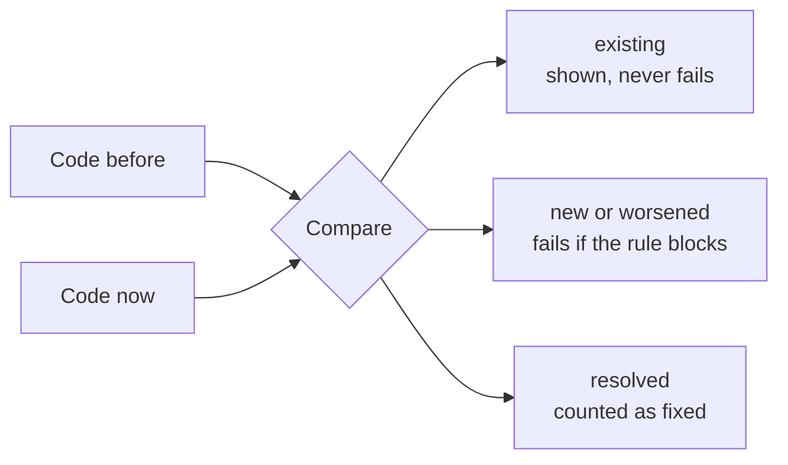

# Key ideas

Everything in lumioguard CC comes down to a few ideas. This page explains them without code.

## Measurements, thresholds and findings

A **measurement** is a number the tool records, such as "this function has a cognitive complexity of
21".

A **threshold** is the highest number your team accepts for that measurement, such as 15. You choose it
in the configuration file.

A **finding** is a measurement over its threshold, or a structural problem such as two files that
depend on each other. Every finding names the file, and usually the function and line.

!!! note "Thresholds are your team's choice"
    There is no universal right number for complexity or length. The defaults are a starting point. They
    only warn until you decide otherwise.

## Blocking and advisory findings

Each rule is either:

- **advisory**: it reports findings but never fails the check, or
- **blocking**: a new or worse finding fails the check.

You switch a rule with `"block": true` or `false`. The label `info`, `warning` or `error` is only a
label; it does not decide anything.

By default, the complexity, size, duplication and fan-out rules are advisory. Dependency cycles and
architecture boundary violations block.

## Comparing with an earlier version

A check on an existing codebase lists every problem it already has. If old problems failed every check,
nobody could ever pass. So lumioguard CC compares with a **reference**:

- a **Git commit** or branch, such as your last commit or `main`, or
- a **stored baseline**: a snapshot of results saved in a file.

Each finding is then labelled:

| Label | Meaning | Can fail the check |
| --- | --- | --- |
| **new** | Not there before | Yes, if the rule blocks |
| **worsened** | There before, and the number went up | Yes, if the rule blocks |
| **existing** | There before, and not worse | No |
| **resolved** | There before, gone now | No |

## Passed, failed and incomplete

Every check ends with one of three results, and a matching exit code for scripts and CI:

| Result | Exit code | Meaning |
| --- | --- | --- |
| **PASSED** | 0 | Everything was analyzed, and nothing blocking is new or worse |
| **FAILED** | 1 | Something blocking is new or worse |
| **INCOMPLETE** | 2 | Part of the code could not be analyzed, or the input was invalid |

**Incomplete always wins.** If a file cannot be read, the result is incomplete, even if everything else
passed. Code the tool could not see must never look clean.

## Where to go next

- [Check your changes](../guides/check-changes.md): compare with a commit or a branch.
- [Rules](../rules/index.md): what each measurement means.
- [FAQ](../help/faq.md): common questions from teams.
