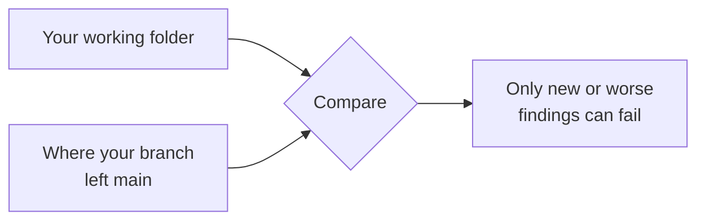

# Check your changes

Compare your code with an earlier version in Git, so the check reports only what your change added or
made worse.

<div class="lg-summary" markdown>

**In short:** run `lumioguard-cc check --base HEAD` before you commit, and
`lumioguard-cc check --base main` before you open a pull request. Fix anything marked `new` or
`worsened`.

</div>

## Your uncommitted work

```bash
lumioguard-cc check --base HEAD
```

This compares your working folder, including files you have not committed yet, with the last commit.

## Your whole branch

```bash
lumioguard-cc check --base main
```

This compares with the point where your branch started from `main`, not with the latest `main`. New
commits on `main` are not held against you.



- **Your checkout is never touched.** The earlier commit is exported to a temporary folder that is
  deleted afterwards.
- **Both sides use today's settings**, so changing a threshold keeps the comparison fair.
- **New untracked files count as added code.**

## Read the result

| You see | What to do |
| --- | --- |
| `PASSED` with no findings marked `(new)` | Nothing got worse. You are done. |
| `PASSED` with `(new)` or `(worsened)` warnings | Your change added advisory findings. Fix them if you can. |
| `FAILED` | A blocking finding is new or worse. Fix it and run the same command again. |
| `INCOMPLETE` | Part of the code was not analyzed. See [Troubleshooting](../help/troubleshooting.md). |

Each finding shows its file, line and rule. The [rules pages](../rules/index.md) explain each rule and
how to bring the number down.

!!! warning "The summary shows at most ten findings"
    Findings that were already there are listed too. For the full list, use `--format json` and look at
    each finding's `classification`. See [Results and report](../reference/results.md).

## Without Git

`--base` needs Git. Without it, run `lumioguard-cc check` before and after your change and compare the
two lists, or save a [stored baseline](baselines.md).

## Next steps

- [Coding agents](coding-agents.md): let an agent run this loop for you.
- [Pull requests and CI](ci.md): run the same comparison on every pull request.
