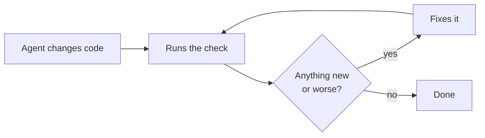

# Coding agents

A coding agent changes code, runs the check, fixes what it made worse, and runs the check again until
it passes.



## Install with an agent

Paste this prompt into Claude Code, Codex or another agent. It adds the lumioguard CC skill, installs
and verifies the program, and sets up the project:

```text
Install lumioguard CC in this project.

1. Add the agent skill: npx skills add https://github.com/lumioguard/lumioguard-cc -y
2. Using that skill, install the lumioguard-cc CLI from
   https://github.com/lumioguard/lumioguard-cc/releases/latest and verify the download.
3. Set up this project with the skill, show me where the code stands, and ask me before
   adding architecture boundaries, agent hooks or PATH changes.

From now on, check your own code changes with lumioguard-cc before you finish.
```

The skill is short. It installs the program, then points the agent at the program's built-in guides
(`lumioguard-cc guide`), so the instructions always match the installed version. `npx skills` needs no
account.

## Decide what blocks first

!!! warning "With the default settings, agents are stopped only for structural problems"
    `init` makes the complexity, size, duplication and fan-out rules advisory. An agent is then stopped
    only for dependency cycles and boundary violations, and a new function with a cognitive complexity
    of 35 still passes.
    Set `"block": true` on the rules you want enforced. This is safe on old code, because only findings
    that are new or worse can block.

## Set up an agent by hand

=== "Claude Code"

    Add this Stop hook to `.claude/settings.json` in your project, keeping any hooks already there:

    ```json
    {
      "hooks": {
        "Stop": [
          {
            "hooks": [
              {
                "type": "command",
                "command": "lumioguard-cc hook claude-stop",
                "timeout": 60
              }
            ]
          }
        ]
      }
    }
    ```

    If the program is not on `PATH`, put its full path in `command`. On Windows use forward slashes.

    When Claude tries to finish, the hook runs a check:

    - **Passed:** it prints nothing, and Claude stops normally.
    - **Failed or incomplete:** it stops Claude from finishing and lists up to five findings that fail,
      with the exact command that reproduces them.
    - **After two blocked attempts** in a session, it lets Claude stop and asks a person to review. An
      agent cannot loop forever.

    To confirm the hook runs, run this in the project folder. No output means it works and nothing
    blocks:

    ```bash
    echo '{"session_id":"setup-test","cwd":"."}' | lumioguard-cc hook claude-stop
    ```

=== "Codex and other agents"

    Add this to `AGENTS.md`, or to your agent's rules file:

    ```text
    Before finishing a code change, run
    `lumioguard-cc check --base HEAD --format json`.
    Exit 0 means done. Exit 1 means fix the findings classified new or
    worsened, then run it again. Exit 2 means the analysis is incomplete;
    read the diagnostics. Never lower thresholds, add exclusions or replace
    a baseline to pass. Details: `lumioguard-cc guide check`.
    ```

    A longer version, with the reasons, is in
    [`integrations/codex/AGENTS.snippet.md`](https://github.com/lumioguard/lumioguard-cc/blob/main/integrations/codex/AGENTS.snippet.md).

## What the hook compares with

| Setting in the hook's environment | Compares with |
| --- | --- |
| Nothing | `HEAD`, the last commit |
| `LUMIOGUARD_CC_BASE=main` | The point where the branch left `main` |
| `LUMIOGUARD_CC_BASELINE=initial` | The stored baseline named `initial` |

The default judges the agent only on what its session changed. Old problems never appear in its
feedback. The hook runs for the nearest folder at or above the agent's working folder that has
`.lumioguard-cc.json`. Setting both variables is an error.

## Reviewing changes to the settings

The skill, the hook and the instructions all tell the agent never to lower thresholds, exclude its own
code or replace a baseline to pass. An agent with write access can still do it. Review changes to
`.lumioguard-cc.json` and `.lumioguard-cc/baselines/` like code, and run the same check in
[CI](ci.md).
