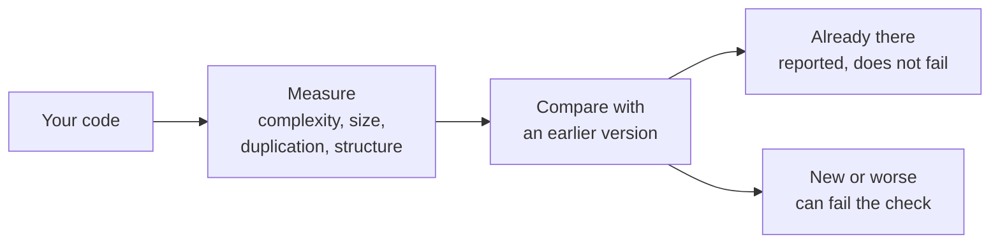

{ .lg-hero__logo }

# lumioguard CC

Keep AI-written code clean as the project grows.

Coding agents write fast, but the code they leave behind gets complex,
duplicated and tangled over time. lumioguard CC sits in the agent loop, checks every change for
problems, and blocks the agent from finishing until the code is clean. The result is a codebase
that stays maintainable and smaller, so agents read fewer tokens on every future task.

[Get started](get-started/index.md){ .md-button .md-button--primary }
[Use it with coding agents](guides/coding-agents.md){ .md-button }

## Common tasks

-   :lucide-git-compare:{ .lg .middle .lg-icon } **Check a change**

    ---

    Compare your work with the last commit, or your branch with `main`, and see what the change
    added.

    [:octicons-arrow-right-24: Check your changes](guides/check-changes.md)

-   :lucide-bot:{ .lg .middle .lg-icon } **Use it with coding agents**

    ---

    Claude Code, Codex and other agents run the check on their own changes and fix what they made
    worse before they finish.

    [:octicons-arrow-right-24: Coding agents](guides/coding-agents.md)

-   :lucide-git-pull-request:{ .lg .middle .lg-icon } **Check pull requests**

    ---

    Run the same check in CI. A pull request fails only on the findings it adds.

    [:octicons-arrow-right-24: Pull requests and CI](guides/ci.md)

-   :lucide-brush-cleaning:{ .lg .middle .lg-icon } **Reduce existing findings**

    ---

    List the functions and files with the most findings, fix them in small steps, and compare the
    numbers before and after.

    [:octicons-arrow-right-24: Clean up existing code](guides/clean-up.md)

## How it works

1. **Measure.** It reads every source file and records a number for each function and file.
2. **Compare.** It matches those numbers against a Git commit or a saved snapshot.
3. **Decide.** The check passes, fails on findings that are new or worse, or reports that part of the
   code could not be analyzed. Code it could not analyze never counts as a pass.

[:octicons-arrow-right-24: The terms used in the results](get-started/key-ideas.md)

## Where to start

-   :lucide-users:{ .lg .middle .lg-icon } **New to lumioguard CC**

    ---

    What it measures, what the results mean, and what a passing check does not tell you. No coding
    needed.

    [:octicons-arrow-right-24: What is lumioguard CC?](get-started/index.md)

-   :lucide-terminal:{ .lg .middle .lg-icon } **Developers**

    ---

    Install the binary and run the first check.

    [:octicons-arrow-right-24: Quick start](get-started/quick-start.md)

-   :lucide-book-open:{ .lg .middle .lg-icon } **Looking something up**

    ---

    Every rule, command, setting and report field.

    [:octicons-arrow-right-24: Rules](rules/index.md) · [Reference](reference/index.md)

## What it does and does not do

:lucide-lock:{ .lg-icon } **Runs on your machine.** It does not upload code, call an AI model or need
an account.
{ .card }

:lucide-scale:{ .lg-icon } **Same input, same output.** A given version of the tool reports the same
numbers on a laptop, in CI and inside an agent.
{ .card }

:lucide-shield-check:{ .lg-icon } **Incomplete analysis does not pass.** If a file cannot be read, the
result is incomplete, not passed.
{ .card }

:lucide-code-xml:{ .lg-icon } **Does not run your code.** It reads source files. It does not start your
program or your tests.
{ .card }

