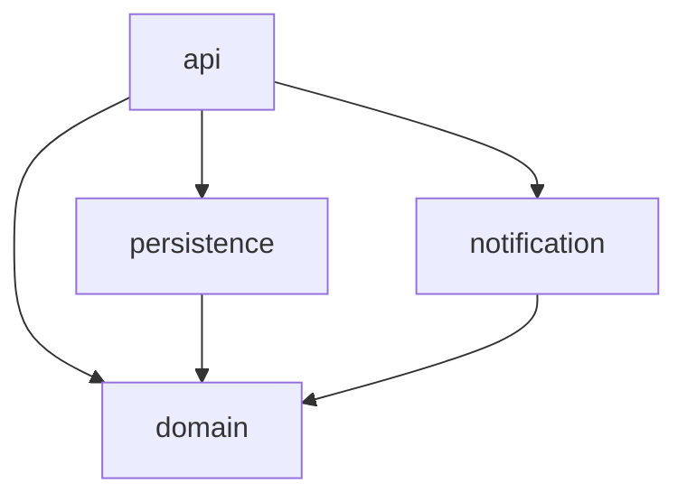

# Architecture boundaries

Declare the layers of your code and which layers each one may use. lumioguard CC then reports every
import that breaks those rules, such as domain code importing the database layer.

<div class="lg-summary" markdown>

| | |
| --- | --- |
| **ID** | `architecture.boundary_violation` |
| **Default** | Off until you declare boundaries; then any new violation blocks |
| **Setting** | `architecture.boundaries`, and `architecture.blockViolations` to block or only warn |

</div>

## Declare your layers

Add boundaries to `.lumioguard-cc.json`. This is the TypeScript example project's configuration:

```json
"architecture": {
  "boundaries": [
    {
      "name": "domain",
      "include": ["src/domain/**"],
      "mayDependOn": ["domain"]
    },
    {
      "name": "persistence",
      "include": ["src/persistence/**"],
      "mayDependOn": ["domain", "persistence"]
    },
    {
      "name": "notification",
      "include": ["src/notification/**"],
      "mayDependOn": ["domain", "notification"]
    },
    {
      "name": "api",
      "include": ["src/api/**"],
      "mayDependOn": ["domain", "persistence", "notification", "api"]
    }
  ]
}
```



Each boundary has:

| Field | Meaning |
| --- | --- |
| `name` | The layer's name |
| `include` | Glob patterns for the layer's files, relative to the project root |
| `mayDependOn` | The layers its files may import |

## Rules to know

- **The first boundary that matches a file owns it.** Put narrower boundaries first.
- **List a layer in its own `mayDependOn`** if its files import each other.
- **Files outside every boundary are not checked**, and neither are imports of packages.

## What a violation looks like

For every import it can trace, the tool checks whether the importing layer may use the imported one. If
not, it reports the import line:

```text
- [error] src/domain/order.ts:1: domain is not allowed to depend on persistence (new)
```

Existing violations are reported, but with a comparison only new ones block.

## How to fix a violation

- **Move the code** to a layer that is allowed to use it.
- **Turn the dependency around:** declare what the inner layer needs, such as a repository interface,
  in the inner layer. Implement it in the outer layer, and connect the two where the application
  starts.
- **Do not widen `mayDependOn` to make the check pass.** The boundaries record your team's design
  decisions. Change them only on purpose.
