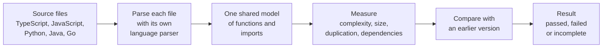
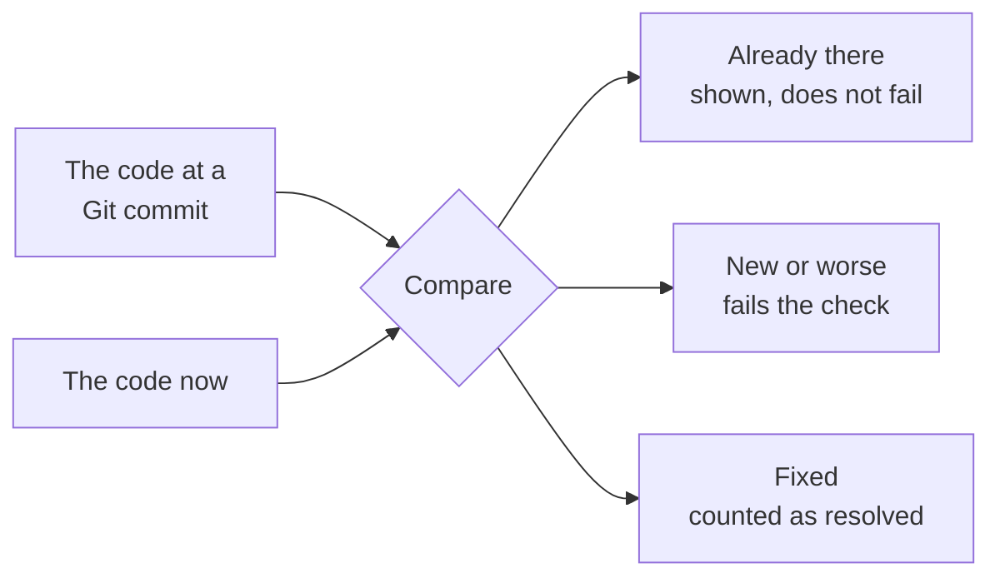
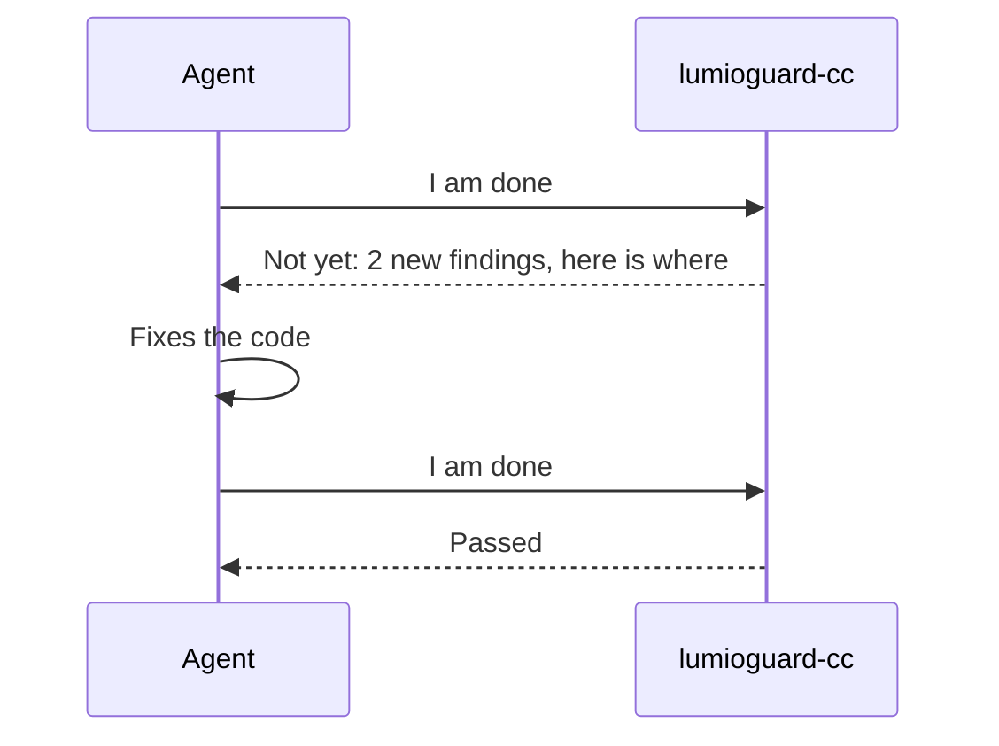
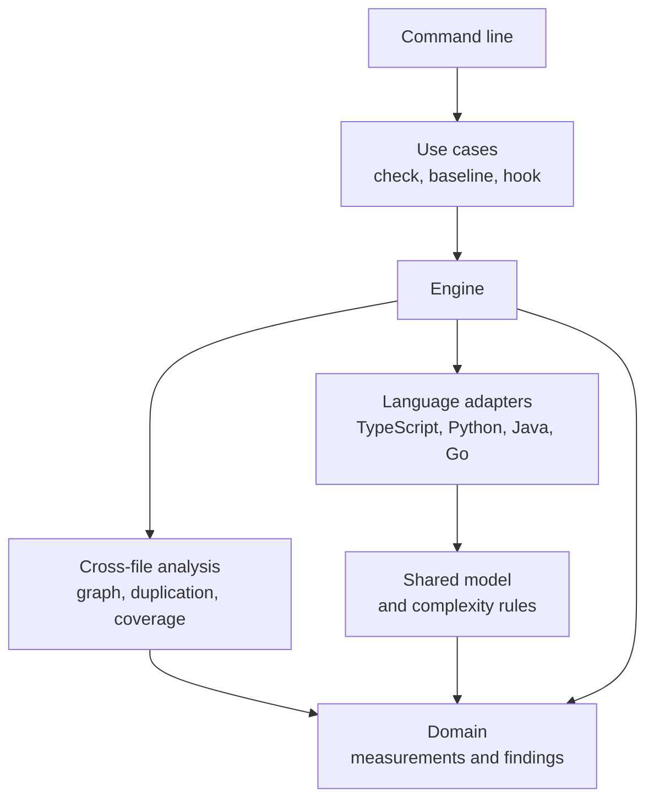

# lumioguard CC

Sits in your coding agent's loop and keeps the code clean as the project grows.
"CC" stands for **Crap Cleaner**.

Coding agents write fast, but the code they leave behind gets complex,
duplicated and tangled over time. Functions grow longer, blocks get copied, and
imports cross layers they should not. Each change is small enough to pass
review, but over time the codebase becomes hard to change, and the agent needs
more tokens to read and rewrite it on every future task.

lumioguard CC breaks that cycle. It checks every change the agent makes for
complex functions, copy-pasted blocks and dependency tangles, and blocks the
agent from finishing until the code is clean. It runs inside the agent loop, on
your machine, with no network, and gives the same result every time for the same
code. Step by step, the codebase stays maintainable, small and cheap for agents
to work with.

## What it checks

| Check | What it reports |
| --- | --- |
| Cyclomatic and cognitive complexity | Functions with too many paths, or too hard to follow |
| Nesting depth | Conditions buried inside conditions |
| Function length and parameter count | Functions doing too many jobs |
| File tokens | Files too big to read in one go, and how many tokens a change added overall |
| Duplication | Blocks of code pasted in more than one place |
| Fan-in and fan-out | Files that depend on, or are depended on by, too many others |
| Dependency cycles | Files that import each other in a loop |
| Architecture boundaries | Imports your layers are not supposed to make |
| Coverage | Code your tests do not run, read from an existing LCOV report |

Every check is explained, with examples, in [the rules pages](.documentations/rules/index.md).

## How it works



- Every language is translated into one shared model, so a complexity of 7 means
  the same thing in TypeScript, Python, Java and Go.
- Thresholds turn numbers into findings. You choose the thresholds, and whether
  each one only warns or can fail the check.
- If a file cannot be analyzed, the result is **incomplete**, never passed.

More detail: [How it works](.documentations/reference/how-it-works.md).

## Old problems and new problems

Checking an existing codebase reports everything that is already wrong with it.
Comparing with an earlier version separates what was already there from what
the change added.



```bash
lumioguard-cc check --base HEAD    # what my uncommitted work changed
lumioguard-cc check --base main    # what my branch changed
```

Git already holds the earlier code, so there is nothing to create or keep up to
date. Teams that want a fixed ceiling can save a baseline file instead. See
[Stored baselines](.documentations/guides/baselines.md).

## With a coding agent



To set this up with an agent, paste the following into Claude Code, Codex or
another agent. It installs the skill and the CLI, sets up the project, and from
then on the agent checks its own changes:

```text
Install lumioguard CC in this project.

1. Add the agent skill: npx skills add https://github.com/lumiostack/lumioguard-cc -y
2. Using that skill, install the lumioguard-cc CLI from
   https://github.com/lumiostack/lumioguard-cc/releases/latest and verify the download.
3. Set up this project with the skill, show me where the code stands, and ask me before
   adding architecture boundaries, agent hooks or PATH changes.

From now on, check your own code changes with lumioguard-cc before you finish.
```

The skill lives in [`skills/lumioguard-cc`](skills/lumioguard-cc/SKILL.md). To wire things
up by hand instead:

- **Claude Code:** copy the `hooks` block from
  [`integrations/claude-code/settings.example.json`](integrations/claude-code/settings.example.json).
  Claude cannot finish while its own changes fail the check. After two attempts
  it stops and hands over to a person.
- **Codex and others:** add [`integrations/codex/AGENTS.snippet.md`](integrations/codex/AGENTS.snippet.md)
  to the agent's instructions.

More detail: [Coding agents](.documentations/guides/coding-agents.md).

## In CI

The GitHub Action installs the release that matches its tag and fails a pull
request only on what the pull request made worse:

```yaml
- uses: actions/checkout@v4
  with:
    fetch-depth: 0            # the comparison needs the target branch
- uses: lumiostack/lumioguard-cc@v0.1.0
```

Add `sarif-file: lumioguard-cc.sarif` and upload the file with
`github/codeql-action/upload-sarif` to see findings in code scanning. See
[Pull requests and CI](.documentations/guides/ci.md).

## Getting started

You need Go 1.27 or later, and Git for `--base`. No Node.js, Python or Java is
needed.

```bash
go install github.com/lumiostack/lumioguard-cc/cmd/lumioguard-cc@latest
```

Or build from a clone with `go build -o bin/lumioguard-cc ./cmd/lumioguard-cc`.

```bash
lumioguard-cc init                    # write .lumioguard-cc.json with defaults
lumioguard-cc check                   # everything that is wrong now
lumioguard-cc check --base HEAD       # only what your change made worse
lumioguard-cc check --format json     # one JSON report for other tools
lumioguard-cc check --format sarif    # findings for GitHub code scanning
lumioguard-cc explain complexity.cognitive
lumioguard-cc guide                   # step-by-step guides: setup, check, cleanup, report, config
```

The defaults only warn. Make a check blocking once the code is clean enough.
See [Configuration](.documentations/reference/configuration.md).

## Results

| Exit code | Meaning |
| --- | --- |
| 0 | Passed: nothing new or worse |
| 1 | Failed: at least one blocking finding is new or worse |
| 2 | Incomplete, or invalid input: something could not be analyzed |

See [Results and report](.documentations/reference/results.md#exit-codes).

## Languages

| Language | Files | Parser |
| --- | --- | --- |
| JavaScript and TypeScript | `.js .jsx .mjs .cjs .ts .tsx .mts .cts` | Microsoft's TypeScript parser |
| Python 3 | `.py .pyw` | Written for this tool, tested against the CPython standard library |
| Java up to 17 | `.java` | Generated from the community ANTLR grammar |
| Go | `.go` | The Go standard library's parser |

A repository with several languages is checked in one run. The tool is written
in Go and checks its own code with the root `.lumioguard-cc.json`.

## Examples

[`.examples/`](.examples/README.md) has one small project per language, written
badly and then fixed. Every number in their reports came from running the tool.

| Project | Blocking findings, before and after |
| --- | --- |
| [TypeScript order service](.examples/typescript-order-service/REPORT.md) | 10 → 0 |
| [Python inventory](.examples/python-inventory/REPORT.md) | 9 → 0 |
| [Java billing](.examples/java-billing/REPORT.md) | 9 → 0 |

```bash
sh .examples/run.sh bin/lumioguard-cc
```

## Documentation

| Section | Read it to |
| --- | --- |
| [Get started](.documentations/get-started/index.md) | Learn what the tool is, install it, and run a first check |
| [Guides](.documentations/guides/index.md) | Check changes, set up coding agents and CI, clean up code, use baselines |
| [Rules](.documentations/rules/index.md) | Understand what each check measures, and how to fix its findings |
| [Reference](.documentations/reference/index.md) | Look up commands, configuration, the report, languages and limits |
| [Help](.documentations/help/index.md) | Solve common problems and read the FAQ |
| [Contribute](.documentations/contributing/index.md) | Report problems, and change, test and release the code |

### Run the documentation portal

The pages are also a searchable website built with [Zensical](https://zensical.org).
You need Python 3.

```bash
python -m venv .venv
source .venv/bin/activate            # Windows PowerShell: .venv\Scripts\Activate.ps1
pip install -r requirements-docs.txt
make docs-serve                      # open http://localhost:8000
```

`make docs` builds the static site into `dist/site` and fails on any broken link.

Without `make`, copy the pages first, because Zensical skips folders whose names
start with a dot, then serve:

```bash
mkdir -p dist && rm -rf dist/docs-src && cp -R .documentations dist/docs-src
zensical serve
```

```powershell
New-Item -ItemType Directory -Force dist | Out-Null
Remove-Item -Recurse -Force dist\docs-src -ErrorAction SilentlyContinue
Copy-Item -Recurse .documentations dist\docs-src
zensical serve
```

## Contributing

Contributions are welcome. Start with [CONTRIBUTING.md](CONTRIBUTING.md), which
covers setup, the checks to run and how pull requests are reviewed. Open an issue
before starting a new rule, a new language or a format change.

The code is organised so dependencies point inwards:



The domain in the middle knows nothing about files, Git or the command line.
Adding a language means writing one adapter. The
[development guide](.documentations/contributing/development.md) explains the design
principles, testing and releases.

| Topic | Where |
| --- | --- |
| How to contribute | [CONTRIBUTING.md](CONTRIBUTING.md) |
| Rules for coding agents | [AGENTS.md](AGENTS.md) |
| Reporting a vulnerability | [SECURITY.md](SECURITY.md) |
| What changed | [CHANGELOG.md](CHANGELOG.md) |

## License

[MIT](LICENSE). All dependencies use permissive licenses: BSD, MIT or Apache-2.0.
[`THIRD-PARTY-NOTICES.md`](THIRD-PARTY-NOTICES.md) holds the notices every
binary distribution must include; each release archive ships with it.

---

Maintained by Lumio Software FZ LLC · [lumioguard.dev](https://lumioguard.dev)
